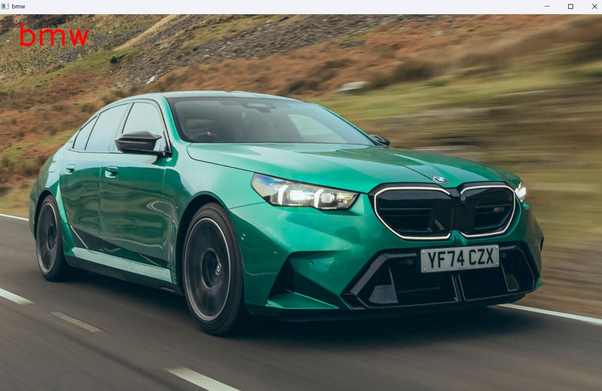
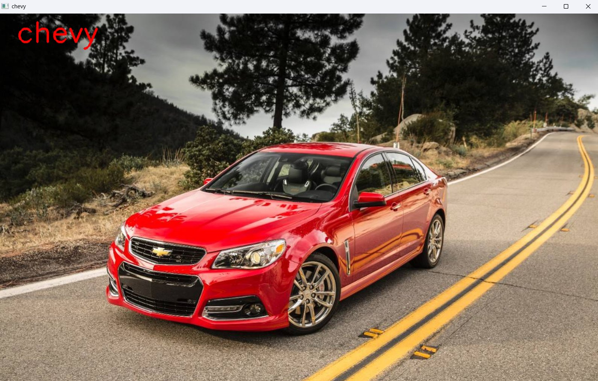

# CarsAI
Simple ML model to visualizing and analyzing car manufacturer from an image.

## How to use the model ?
- First step download the project on your local machine by running this command in your terminal : `git clone https://github.com/Saad711T/CarsAI`
- Then enter the project in your IDE (Such as VSCode) and running this command : `python main.py test.png` main.py is the main code for running the program , but test.png is the targeted image.
## Project files
- `requirements.txt` : File contain required libraries for this project.
- `chevy.py` : Python code shows a Chevy SS car picture with small algorithm.
- `ford.py` : Python code shows a Ford Taurus car picture with small algorithm .
- `toyota.py` : Python code shows a Toyota Supra GR car picture with small algorithm .
- `ferrari.py` : Python code shows a Ferrari car picture with small algorithm.
- `bmw.py` : Python code shows a BMW M5 car picture with small algorithm.
- `train.py` : Python code to training the model and given the output in `car_model.pth`.
- `main.py` : Driver code to run the program.
- `datasets` : Small dataset for cars images , structured in manufacturer folders.

### Examples

 

#### Credits
[0xSaad](https://www.linkedin.com/in/saadalmalki711)
